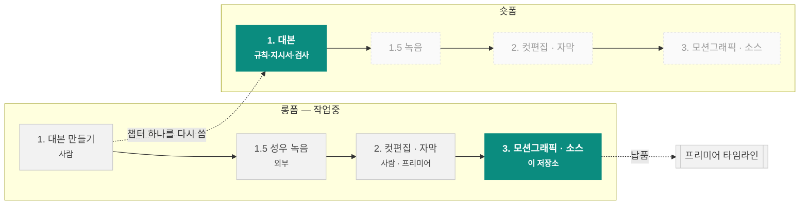

# 차트 컷씬 렌더러

해외선물 유튜브 채널 **차트명가** 영상에 쓸 차트 모션그래픽 소스 영상을 코드로 렌더합니다.

    

📊 **[작업 로그 대시보드](https://claude.ai/code/artifact/cfb762d2-2caf-4a18-8ec2-696b884ac0e1)** · [전체 기록](log/WORKLOG.md) · [새 세션 안내](CLAUDE.md)

---

## 이 저장소가 맡는 곳

영상 한 편은 네 단계를 거칩니다. 이 저장소는 그중 **롱폼 3단계(모션그래픽)** 와
**숏폼 1단계(대본)** 를 맡습니다. 나머지는 사람이 합니다.



| 포맷 | 단계 | 담당 | 상태 | |
|---|---|---|---|---|
| 롱폼 | 1. 대본 만들기 | 사람 | 🔵 자료만 |  |
| 롱폼 | 1.5 성우 녹음 | 외부 | ➖ 해당없음 |  |
| 롱폼 | 2. 컷편집 및 자막 달기 | 사람 | ⚪ 미착수 |  |
| 롱폼 | 2.5 썸네일 제작 | 로컬 클로드 | 🔵 자료만 |  |
| 롱폼 | 3. 모션그래픽 및 소스 넣기 | 이 저장소 | 🟢 진행중 | **← 여기** |
| 숏폼 | 1. 대본 만들기 | 사람 + 이 저장소 | 🟢 진행중 | **← 여기** |
| 숏폼 | 1.5 성우 녹음 | 외부 | ➖ 해당없음 |  |
| 숏폼 | 2. 컷편집 및 자막 달기 | 사람 | ⚪ 미착수 |  |
| 숏폼 | 3. 모션그래픽 및 소스 넣기 | 이 저장소 | ⚪ 미착수 |  |

> 🟢 진행중 · 🔵 결과물만 저장소에 있음 · ⚪ 미착수 · ➖ 저장소가 관여 안 함

**롱폼 3단계** — 받는 것은 타임코드가 붙은 대본(2단계 산출물), 내놓는 것은 차트만 있는 영상 클립입니다. 자막·타이틀·로고는 2단계에서 이미 들어가므로 렌더에 넣지 않습니다.

**숏폼 1단계** — 롱폼 챕터 하나를 골라 350~560자로 다시 씁니다. 대본을 대신 쓰는 게 아니라 규칙·작성 지시서·검사를 제공합니다.

## 롱폼과 숏폼

| | 화면비 | 채널 최종본 | 우리가 납품 | 길이 | 톤앤매너 |
|---|---|---|---|---|---|
| **롱폼** | 16:9 | 1280x720 / 30fps (채널 최종본 실측) | 1920x1080 / 59.94fps (우리가 납품하는 컷씬 소스) | 10~20분 | 차분한 설명조. 기획서+스크립트 6천자 안팎, 섹션 6개(후킹·소개·본론1·문제제시·본론2·아웃트로) |
| **숏폼** | 9:16 | 1080x1920 / 30fps (최종본 260703 실측) | 미정 (모션그래픽 단계 미착수) | 목표 45초. 나간 편 실측 중앙값 55.9초 (자막 13편) | 대본은 조사됨 — 훅·근거·본론·CTA 4단, 초당 6.6자, 한 편이 롱폼의 9%. 화면 톤앤매너는 아직 미조사 |

숏폼은 세로 프레임이라 차트 레이아웃을 다시 잡아야 합니다. 렌더러는 그대로 쓰되 `layout`·`visibleBars` 부터 새로 정해야 하고, 그 전에 최종본 숏츠를 실측해 톤앤매너를 잡는 것이 먼저입니다.

---

## 숏폼 대본을 뽑는 규칙

나간 숏폼 25편과 원본 롱폼 13편을 맞춰 보고 역으로 구한 것입니다. 핵심은 **복붙이 아니라 다시 쓴다** — 10자 n-gram 겹침이 중앙값 2.2%뿐입니다.

```
롱폼 한 편 (약 4,000자)
   ├─ 챕터 하나를 고른다     ← #1 은 앞쪽, #2 는 뒤쪽 (12쌍 중 11쌍)
   └─ 45초 = 307자로 다시 쓴다  ← 초당 6.82자, 자막 13편 실측

        ① 훅    오늘은 …를 알려드릴게요       26자 / 3.6초   고정
        ② 근거  통념 → 하지만 → 손실
        ③ 본론  기준·설정값·순서를 숫자로      255자 / 39초   여기서 조절
        ④ CTA   질문으로 넘김 + 고정 3줄      26자 / 2.7초   고정
                → 이 질문이 다음 편의 주제가 된다
```

**훅과 CTA 는 길이와 무관하게 거의 고정입니다. 줄일 때는 본문에서만 줄입니다.**
나간 편들의 실제 길이는 중앙값 **55.9초** — 목표보다 24% 깁니다. 45초 밑은 13편 중 3편뿐입니다.

| 등급 | 규칙 | 기존 |
|---|---|---|
| 필수 | 숏폼 한 편 = 롱폼 챕터 한 개. 여러 챕터를 섞지 않는다 | — |
| 권장 | #1 은 롱폼 앞쪽, #2 는 뒤쪽에서 온다 | 11/12편 |
| 권장 | #1 은 '왜 필요한가/무엇이 문제인가', #2 는 '그래서 어떻게 하는가' | — |
| 필수 | 복붙이 아니라 다시 쓴다 | — |
| 필수 | 45초가 목표. 307자다 | — |
| 필수 | 훅은 «오늘은 …를 알려드릴게요» 한 문장 | 22/24편 |
| 권장 | «아래/다음 영상» 으로 넘긴다 | 20/24편 |
| 권장 | 근거에 역접을 한 번 넣는다 — 하지만/그런데/반대로 | 19/24편 |
| 권장 | «저를 팔로우하고 / 구독해주세요» | 17/24편 |
| 필수 | #N 의 CTA 질문이 곧 #N+1 의 주제다 | — |
| 필수 | '포인트(포)' 편은 이 규칙이 아니다 | — |
| 필수 | 자막·타이틀·로고 문구는 대본에 쓰지 않는다 | — |
| 필수 | 폴더는 YYMMDD_[SL_차XX_#X]숏폼제목, 파일은 [SL]숏폼제목[롱폼제목#X].txt | 25/25편 |
| 필수 | 작업 중에는 폴더·파일 맨 앞에 (중간) 을 붙인다 | — |
| 필수 | 줄일 때는 본문에서만 줄인다 | — |

등급은 기존 24편 중 몇 편이 지켰는지로 나눴습니다. 5개를 모두 지킨 편은 2편뿐이라 **경향에 가깝습니다 — 권장은 어겨도 됩니다.** 일정표에서 `숏폼(포)`로 표시된 편은 기획형이라 이 규칙 밖입니다.

**`포인트_차` 갈래는 위 SL 규칙과 별도입니다** — 기준선부터 다릅니다(New 10편 실측 53.9초 · 362자 · 6.70자/초, SL 값 사용 금지). 규칙 6개는 `SELECT * FROM shortform_rule WHERE grp='포인트';`, 상세는 [log/SCRIPT-LAB.md](log/SCRIPT-LAB.md).

**폴더·파일 이름**도 매뉴얼이 있습니다. 작업 중에는 둘 다 앞에 `(중간)` 을 붙입니다.

```
숏폼 폴더    YYMMDD_[SL_차XX_#X]숏폼제목
         예) 260827_[SL_차11_#4]20일선 추세추종 매매법
숏폼 파일    [SL]숏폼제목[롱폼제목#X].txt
         예) [SL]20일선 추세추종 매매법[20일선의 비밀#4].txt
작업 중     맨 앞에 (중간) 을 붙인다
         예) (중간)260827_[SL_차11_#4]20일선 추세추종 매매법 / (중간)[SL]20일선 추세추종 매매법[20일선의 비밀#4].txt
```

```bash
python3 tools/shortform.py chapters 11                      # 롱폼 챕터 보기
python3 tools/shortform.py brief 11 --chapter '전략 1' --no 4  # 작성 지시서
python3 tools/shortform.py name 11 --no 4 --title '제목'      # 이름 짓기
python3 tools/shortform.py check 초안.txt                    # 규칙 + 이름 검사
```

---

## 현황

**롱폼 3단계 내부 절차** `███████████░` 8/9 자동화

| 단계 | 방법 | 담당 |
|---|---|---|
| ✅ 1. 대본 수령 | 타임코드가 붙은 .srt 를 받는다 | 사용자 |
| ✅ 2. 주제·소재·키워드 정리 | 대본에서 검색어가 될 키워드를 뽑는다 | 클로드 |
| ✅ 3. 작업물 폴더 검색 | 이제 드라이브에 붙지 않아도 된다. script_fts 전문 검색과 script_keyword 역인덱스가 저장소 안에 있다 (… | 클로드 |
| ✅ 4. 레퍼런스 확정 | script_keyword 로 키워드 일치율이 가장 높은 회차를 고른다. 그 회차의 최종 .prproj 는 episode_pr… | 클로드 |
| ✅ 5. 레퍼런스 확인 | 그 회차의 .prproj 를 gunzip 해서 XML 을 직접 읽는다. 시퀀스·이펙트·키프레임·애셋 경로가 모두 평문으로 들어… | 클로드 |
| ✅ 6. 컷 설계 + scenes.js 작성 | 타임코드를 프레임으로 환산하고 cmg-20ma-runner.scenes.js 를 본떠 layers 를 채운다 | 클로드 |
| ✅ 7. 구도 확인 | --stills 로 스틸컷을 먼저 본다. 겹침은 여기서 잡는다 | 클로드 |
| ✅ 8. 렌더 | --all 순차로 충분하다 (2026-08-27 캡처 교체 후 병렬 이득 소멸) | 자동 |
| ⬜ 9. 프리미어 반입 | 지금은 사용자가 직접 넣는다. 자동화하려면 사용자 PC 에 프리미어 MCP 설치 필요 | 사용자 |

| 갖춰 놓은 것 | 수 | 쓰임 |
|---|---:|---|
| 대본 인덱스 | 13편 | 새 대본과 겹치는 회차를 전문 검색으로 찾는다 (차명14·15 2편은 아직 빈 템플릿) |
| 회차 프리미어 파일 | 37건 | 레퍼런스 확인 (`.prproj` 를 직접 읽는다) |
| 브랜드 실측값 | 30건 | 색·크기. 레퍼런스 프레임에서 픽셀 단위로 잰 값 |
| 레이어 | 22종 | 컷을 짤 때 쓰는 재료 |
| 회사 모션 문법 | 3종 | 최종본 키프레임에서 뽑은 프레임 수·이징 |

**최근 납품** — 20일선 눌림목 / 조기 익절 4컷, 956프레임 · 1920×1080 · 59.94fps  
**렌더 실측** — 15.95초 클립 기준 순차 26.8초 (`--preset medium` 24.1초). 캡처 교체(2026-08-27) 뒤로는 한 프로세스가 4코어를 포화시켜 컷별 병렬의 이득이 없다

---

## 빠른 시작

```bash
npm install
npm run setup:fonts                        # 리눅스만. 폰트 등록
npm run render -- --config scenes/cmg-20ma-runner.scenes.js --all --stills 5
npm run render -- --config scenes/cmg-20ma-runner.scenes.js --all
```

`--all` 순차면 충분합니다. 컷별 병렬은 캡처 교체 뒤 이득이 사라져 쓰지 않습니다.

```bash
npm run render -- --config ... --all --preset medium   # 급할 때. 파일 +2%
npm run render -- --config ... --all --capture shot    # 예전 캡처 경로 (대조용)
node src/tools/exp-capture.mjs                         # 환경이 바뀌면 재실측
```

## 되돌리기

작업 한 덩어리마다 세이브 슬롯을 만듭니다. 슬롯 하나가 그 시점의 저장소 전체입니다.

```bash
python3 log/save.py "어디까지 했는지 한 줄"   # 세이브
python3 log/save.py --list                    # 슬롯 목록
git restore --source=<해시> -- .              # 되돌리기
```

| 시각 (KST) | 슬롯 | 커밋 | 어디까지 |
|---|---|---|---|
| 2026-08-29 04:05 | `save/2026-08-29-0405` | `ccde4f3` | 11-4 v6 — 이격음봉 세트 컷 경계 이어받기+페이드, CTA 원 등장 순서(캔들→원) |
| 2026-08-29 03:59 | `save/2026-08-29-0359` | `6856476` | 11-5 v5 — cmgTrace 신설(선 구간 접선 덧칠, 팀장 기법), 누운 이평선 강조 적용 |
| 2026-08-29 03:49 | `save/2026-08-29-0349` | `d530ece` | 11-4 v5 — 이격 음봉 시점 재줌인, 컷5 줌 연결(1.1→0.8) |
| 2026-08-29 03:39 | `save/2026-08-29-0339` | `5762dee` | SL v4 — 놓친 구간(빗금 안 대형+밑줄, 러너 기법), 엔딩 titleCard(딤+정중앙), 손절 어절 스냅 |
| 2026-08-29 03:20 | `save/2026-08-29-0320` | `e129882` | SL v3 디테일 — 놓친 구간 빗금, 컷 경계 줌 트랜지션(끊김 제거), 11-5 마켓 재튜닝(seed 73 박스 22봉), 손절 싱크·라인 유지, cmgLevel 라벨 클램프 |
| 2026-08-29 01:24 | `save/2026-08-29-0124` | `f0a17dc` | SL 차11-4·11-5 v2 — 컷편집 노이즈 정밀 제거(무음 스냅·헛출발 컷), 효과 pool 실측, 씬 v2(익절 태그·1:2 색 박스·검은 박스선·cmgCross) |

---

## 어디에 무엇이 있나

| 경로 | 역할 |
|---|---|
| `README.md` | 렌더러 사용법 · 포맷 선택 기준 · 씬 설정 레퍼런스 |
| `brand/SHORTFORM-FX-POOL.md` | 숏폼 1:1 박스 효과 pool 실측 22종 + 팀장 규칙 4개 (최종본 6편 전수 조사) |
| `brand/STYLE.md` | 차트명가 브랜드 스펙. 색·레이아웃·폰트·스크립트 6단 구조 |
| `brand/fonts` | Gmarket Sans / S-Core Dream / 나눔고딕 / 경기천년제목 |
| `brand/logo` | 차트명가 로고 7종 |
| `brand/premiere` | 차트명가_메인프리셋(24버전).prproj |
| `brand/reference` | 레퍼런스 영상 캡처 4장. 색을 실측한 원본 |
| `brand/sfx` | 효과음 2종 |
| `brand/texture` | 종이 배경, 모눈종이·땡땡이 패턴, 점선 |
| `brand/thumbnail` | 템플릿에서 뽑은 로고·종이 배경 |
| `brand/thumbnail/btn_매수.png` | 템플릿에서 뜯은 매수 버튼 원본 픽셀 (189x90) |
| `brand/thumbnail/btn_익절.png` | 매수 버튼을 좌우 반전해 #00FF24 로 칠하고 익절 글자를 얹은 것 (185x90) |
| `brand/thumbnail/로고.png` | 템플릿 로고 원본 픽셀 (209x52) |
| `brand/thumbnail/종이배경.png` | 템플릿 종이 텍스처 원본 픽셀 |
| `brand/thumbnail/틀.png` | 템플릿 '틀' 도형 원본 픽셀 (안쪽 투명) |
| `brand/ui` | 매수·매도 버튼, 시네마스코프, 댓글 유도 |
| `deliver/shortform` | 납품한 숏폼 자막·컷리스트 (영상·음성은 드라이브/전달분에만) |
| `deliver/thumbnail` | 채택된 썸네일. out/ 은 .gitignore 라 여기에 따로 둔다 |
| `lab/cutedit` | CAM 촬영본 전사 원본(cam_transcript.json) — 컷 재현·재검증용 |
| `log/PREMIERE-LAB-MANUAL.md` | 프리미어 직접 편집 실험(D 세션) 매뉴얼 — 경로·마일스톤·함정·병합 프로토콜 |
| `log/PREMIERE-LAB-REPORT.md` | D 의 M2~M6 총괄 보고 — 판정표·매뉴얼 정정·등재 요청·판단 요청 4건 |
| `log/RENDER-REVIEW.md` | 렌더 속도 리뷰 의뢰서 — 코드 지도·실측·열린 질문 |
| `log/SCRIPT-AGENT-MANUAL.md` | 대본 담당(E 세션) 인수인계 매뉴얼 — 자산 지도·숫자·작업 순서·병합 프로토콜 |
| `log/SCRIPT-LAB.md` | E 의 인계 보고서 — 포인트_차 실측 3종(카피 모드·기준선·New 형식), 기준선 오판 교훈, 미반영 피드백 3건과 참고 원고 |
| `log/THUMBNAIL-REVIEW.md` | 썸네일 코드 검토 보고서 + 로컬 푸시 확인 절차 (2026-08-27) |
| `log/WORKLOG.md` | 이 DB 에서 뽑은 작업 로그 |
| `log/build_worklog_db.py` | 로그 DB 생성. 내용을 고칠 때 여기만 고친다 |
| `log/build_worklog_page.py` | DB → HTML 페이지 |
| `log/data` | 롱폼 대본 인덱스·숏폼 대본·세이브 슬롯 (JSON) |
| `log/worklog.db` | 작업 로그 원본 (SQLite) |
| `log/worklog.html` | 브라우저로 보는 작업 로그 |
| `package.json` | 의존성과 npm 스크립트 |
| `scenes/cmg-20ma-runner.scenes.js` | 차트명가 20일선 4컷. 새 대본은 이 파일을 본떠 만든다 |
| `scenes/nq-basic.scenes.js` | 다크 테마 NQ 6컷 (첫 버전, 브랜드 적용 전) |
| `scenes/nq-overlay.scenes.js` | 투명 배경 오버레이 3컷 |
| `scenes/sl-11-4.scenes.js` | 숏폼 차11-4 추세추종 5컷 — 1080x1080/30fps, 내레이션 46.77초에 동기 |
| `scenes/sl-11-5.scenes.js` | 숏폼 차11-5 박스권 6컷 — seed 71 튜닝(가짜 돌파 2회·하단 반등·장대 음봉) |
| `scenes/thumb-ch11-A.scenes.js` | 차11 썸네일 A안 — 추세추종. 눌림목 매수 53번 → 완전 이격 음봉 익절 87번 |
| `scenes/thumb-ch11-B.scenes.js` | 차11 썸네일 B안 — 박스권. 순수 range 시장(seed 7)으로 EMA20 이 화면 내내 눕는다 |
| `scenes/thumb-ch11-C.scenes.js` | 차11 썸네일 C안 — 통합. 박스 점선 + 추세 진입/청산을 한 컷에 |
| `scenes/thumb-ch11.scenes.js` | 차11 썸네일용 차트 2안 |
| `scripts/shortform` | 숏폼 대본 초안. 규칙대로 쓴 것 |
| `src/cli.mjs` | 렌더 CLI. --all --scene --format --stills --reel |
| `src/market/candles.js` | 시드 고정 캔들 생성기. 추세/박스권/돌파/눌림/급등락 |
| `src/render/anim.js` | 이징·타임라인·cue. in 을 생략하면 처음부터 떠 있는 것으로 본다 |
| `src/render/capture.mjs` | Playwright 프레임 캡처, 크로미움 경로 탐색 |
| `src/render/chart.js` | 캔들·이평선·축·그리드 캔버스 드로잉, 뷰포트 계산 |
| `src/render/encode.mjs` | ffmpeg 인코딩. mp4/mov/alpha/webm/png |
| `src/render/engine.js` | 씬 런타임. 프레임 번호를 받아 그린다 |
| `src/render/layers.js` | 오버레이 레이어 22종. 레이어를 추가하려면 여기 |
| `src/render/scene.html` | 렌더 스테이지. @font-face 선언이 여기 있다 |
| `src/render/server.mjs` | 렌더용 정적 서버 |
| `src/render/theme.js` | 테마 프리셋. dark / chartmyeongga |
| `src/tools/exp-capture.mjs` | 캡처 경로 4가지를 실전 루프로 재고 픽셀·mp4 md5 동일성을 대조한다 |
| `src/tools/install-fonts.mjs` | 폰트를 시스템에 등록 |
| `src/tools/profile-render.mjs` | 한 프레임이 어디에 시간을 쓰는지 쪼개서 잰다 |
| `tools` | 숏폼 대본 규칙(shortform.py) 등 대본·자료용 스크립트 |
| `tools/cutedit` | 숏폼 컷편집 파이프라인 — transcribe(전사)·align_cut(대본 정렬)·build_cuts(컷·자막·내레이션 생성, 무음 스냅·침묵 압축) |
| `tools/legacy` | 1세대 썸네일 도구 격리(실행 금지) — psdwrite.py·thumbnail.py. 효과 손그림·폭 역산 |
| `tools/photoshop` | 포토샵 COM+ExtendScript 로 템플릿 .psd 를 직접 편집한다 — 썸네일은 이 경로가 최신 |
| `tools/photoshop/build_thumb.jsx` | 회차 그룹 복제 → 차트 교체 → 타이틀 교체 → 다른 회차 제거 → .psd/.png/.jpg |
| `tools/photoshop/config.json` | 템플릿·차트·출력 경로와 회차 문구 — 컨테이너의 thumbnail_png.py 도 같은 파일을 읽는다(스펙 단일화, decision 21) |
| `tools/photoshop/dump_episodes.jsx` | 완성 회차를 한 장씩 뽑고 레이어 트리를 받아 적는다 — 규칙을 뽑을 때 |
| `tools/photoshop/dump_layer_fx.jsx` | 레이어 효과(lfx2)를 ActionManager 로 값까지 읽는다 |
| `tools/photoshop/dump_text_runs.jsx` | 타이틀을 문자 단위로 읽어 한 줄 안에서 색·크기가 갈리는 곳을 찾는다. config 에 runsTarget 을 넣으면 결과물 .psd 도 검사한다 |
| `tools/photoshop/run.ps1` | 포토샵을 COM 으로 띄워 .jsx 를 실행하는 드라이버 |
| `tools/premiere` | 프리미어 자동화 (D 영역) — run.ps1(BridgeTalk 드라이버)·jobs/*.jsx·verify.py(되읽기 검사기)·presets/30fps sqpreset |
| `tools/psdedit.py` | 템플릿 .psd 를 편집한다 — 그룹 복제·텍스트 교체·픽셀 교체 |
| `tools/thumbnail_png.py` | 롱폼 썸네일을 .png 로 뽑는다 — 차트 한 장, 완성본 한 장 |

## 컨텍스트가 날아갔을 때

`log/worklog.db` 한 파일에 전부 들어 있습니다. 순서대로 읽으면 됩니다.

```sql
-- 0. 이 저장소가 맡는 범위
-- 1. 무엇을 하는 저장소인가
-- 2. 어디에 무엇이 있나
-- 3. 환경 다시 깔기
-- 4. 렌더 돌리기
-- 5. 새 대본 받으면
-- 6. 원본 자료 위치
-- 7. 대본 받고 납품까지 순서
-- 8. 렌더에 걸리는 시간
-- 9. 지난 회차 대본 찾기
-- 10. 회사 모션 문법
-- 11. 되돌릴 수 있는 시점
-- 12. 숏폼 대본 만드는 법
-- 13. 파일·폴더 이름 규칙
-- 14. 썸네일 만드는 법
SELECT * FROM v_start_here;   -- 이 순서대로
SELECT * FROM v_scope;        -- 파이프라인 어디를 맡는가
SELECT * FROM runbook;        -- 명령어
SELECT * FROM constraint_note;-- 이미 부딪혀 본 벽
```

<sub>이 문서는 `log/worklog.db` 에서 자동 생성됩니다 — `python3 log/build_readme.py`. 직접 고치지 말고 DB 를 고치세요.</sub>
