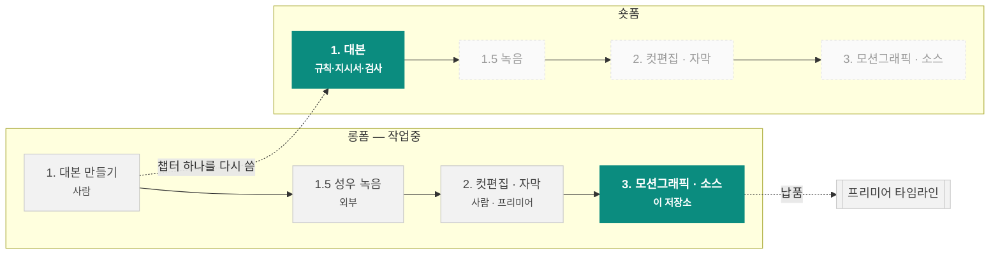

# 차트 컷씬 렌더러

해외선물 유튜브 채널 **차트명가** 영상에 쓸 차트 모션그래픽 소스 영상을 코드로 렌더합니다.

    

📊 **[작업 로그 대시보드](https://claude.ai/code/artifact/cfb762d2-2caf-4a18-8ec2-696b884ac0e1)** · [전체 기록](log/WORKLOG.md) · [새 세션 안내](CLAUDE.md)

---

## 이 저장소가 맡는 곳

영상 한 편은 네 단계를 거칩니다. 이 저장소는 그중 **롱폼 3단계(모션그래픽)** 와
**숏폼 1단계(대본)** 를 맡습니다. 나머지는 사람이 합니다.



| 포맷 | 단계 | 담당 | 상태 | |
|---|---|---|---|---|
| 롱폼 | 1. 대본 만들기 | 사람 | 🔵 자료만 |  |
| 롱폼 | 1.5 성우 녹음 | 외부 | ➖ 해당없음 |  |
| 롱폼 | 2. 컷편집 및 자막 달기 | 사람 | ➖ 해당없음 |  |
| 롱폼 | 2.5 썸네일 제작 | 로컬 클로드 B | 🟢 진행중 |  |
| 롱폼 | 3. 모션그래픽 및 소스 넣기 | 이 저장소 | 🟢 진행중 | **← 여기** |
| 숏폼 | 1. 대본 만들기 | E 세션 | 🟢 진행중 |  |
| 숏폼 | 1.5 성우 녹음 | 외부 | ➖ 해당없음 |  |
| 숏폼 | 2. 컷편집 및 자막 달기 | 이 저장소 + E 세션 | 🟢 진행중 | **← 여기** |
| 숏폼 | 3. 모션그래픽 및 소스 넣기 | 이 저장소 | 🟢 진행중 | **← 여기** |

> 🟢 진행중 · 🔵 결과물만 저장소에 있음 · ⚪ 미착수 · ➖ 저장소가 관여 안 함

**롱폼 3단계** — 받는 것은 타임코드가 붙은 대본(2단계 산출물), 내놓는 것은 차트만 있는 영상 클립입니다. 자막·타이틀·로고는 2단계에서 이미 들어가므로 렌더에 넣지 않습니다.

**숏폼 1단계** — 롱폼 챕터 하나를 골라 350~560자로 다시 씁니다. 대본을 대신 쓰는 게 아니라 규칙·작성 지시서·검사를 제공합니다.

## 롱폼과 숏폼

| | 화면비 | 채널 최종본 | 우리가 납품 | 길이 | 톤앤매너 |
|---|---|---|---|---|---|
| **롱폼** | 16:9 | 1280x720 / 30fps (채널 최종본 실측) | 1920x1080 / 59.94fps (우리가 납품하는 컷씬 소스) | 10~20분 | 차분한 설명조. 기획서+스크립트 6천자 안팎, 섹션 6개(후킹·소개·본론1·문제제시·본론2·아웃트로) |
| **숏폼** | 9:16 | 1080x1920 / 30fps (최종본 260703 실측) | 미정 (모션그래픽 단계 미착수) | 목표 45초. 나간 편 실측 중앙값 55.9초 (자막 13편) | 대본은 조사됨 — 훅·근거·본론·CTA 4단, 초당 6.6자, 한 편이 롱폼의 9%. 화면 톤앤매너는 아직 미조사 |

숏폼은 세로 프레임이라 차트 레이아웃을 다시 잡아야 합니다. 렌더러는 그대로 쓰되 `layout`·`visibleBars` 부터 새로 정해야 하고, 그 전에 최종본 숏츠를 실측해 톤앤매너를 잡는 것이 먼저입니다.

---

## 숏폼 대본을 뽑는 규칙

나간 숏폼 25편과 원본 롱폼 13편을 맞춰 보고 역으로 구한 것입니다. 핵심은 **복붙이 아니라 다시 쓴다** — 10자 n-gram 겹침이 중앙값 2.2%뿐입니다.

```
롱폼 한 편 (약 4,000자)
   ├─ 챕터 하나를 고른다     ← #1 은 앞쪽, #2 는 뒤쪽 (12쌍 중 11쌍)
   └─ 45초 = 307자로 다시 쓴다  ← 초당 6.82자, 자막 13편 실측

        ① 훅    오늘은 …를 알려드릴게요       26자 / 3.6초   고정
        ② 근거  통념 → 하지만 → 손실
        ③ 본론  기준·설정값·순서를 숫자로      255자 / 39초   여기서 조절
        ④ CTA   질문으로 넘김 + 고정 3줄      26자 / 2.7초   고정
                → 이 질문이 다음 편의 주제가 된다
```

**훅과 CTA 는 길이와 무관하게 거의 고정입니다. 줄일 때는 본문에서만 줄입니다.**
나간 편들의 실제 길이는 중앙값 **55.9초** — 목표보다 24% 깁니다. 45초 밑은 13편 중 3편뿐입니다.

| 등급 | 규칙 | 기존 |
|---|---|---|
| 필수 | 숏폼 한 편 = 롱폼 챕터 한 개. 여러 챕터를 섞지 않는다 | — |
| 권장 | #1 은 롱폼 앞쪽, #2 는 뒤쪽에서 온다 | 11/12편 |
| 권장 | #1 은 '왜 필요한가/무엇이 문제인가', #2 는 '그래서 어떻게 하는가' | — |
| 필수 | 복붙이 아니라 다시 쓴다 | — |
| 필수 | 45초가 목표. 307자다 | — |
| 필수 | 훅은 «오늘은 …를 알려드릴게요» 한 문장 | 22/24편 |
| 권장 | «아래/다음 영상» 으로 넘긴다 | 20/24편 |
| 권장 | 근거에 역접을 한 번 넣는다 — 하지만/그런데/반대로 | 19/24편 |
| 권장 | «저를 팔로우하고 / 구독해주세요» | 17/24편 |
| 필수 | #N 의 CTA 질문이 곧 #N+1 의 주제다 | — |
| 필수 | '포인트(포)' 편은 이 규칙이 아니다 | — |
| 필수 | 자막·타이틀·로고 문구는 대본에 쓰지 않는다 | — |
| 필수 | 폴더는 YYMMDD_[SL_차XX_#X]숏폼제목, 파일은 [SL]숏폼제목[롱폼제목#X].txt | 25/25편 |
| 필수 | 작업 중에는 폴더·파일 맨 앞에 (중간) 을 붙인다 | — |
| 필수 | 줄일 때는 본문에서만 줄인다 | — |

등급은 기존 24편 중 몇 편이 지켰는지로 나눴습니다. 5개를 모두 지킨 편은 2편뿐이라 **경향에 가깝습니다 — 권장은 어겨도 됩니다.** 일정표에서 `숏폼(포)`로 표시된 편은 기획형이라 이 규칙 밖입니다.

**`포인트_차` 갈래는 위 SL 규칙과 별도입니다** — 기준선부터 다릅니다(New 10편 실측 53.9초 · 362자 · 6.70자/초, SL 값 사용 금지). 규칙 6개는 `SELECT * FROM shortform_rule WHERE grp='포인트';`, 상세는 [log/SCRIPT-LAB.md](log/SCRIPT-LAB.md).

**폴더·파일 이름**도 매뉴얼이 있습니다. 작업 중에는 둘 다 앞에 `(중간)` 을 붙입니다.

```
숏폼 폴더    YYMMDD_[SL_차XX_#X]숏폼제목
         예) 260827_[SL_차11_#4]20일선 추세추종 매매법
숏폼 파일    [SL]숏폼제목[롱폼제목#X].txt
         예) [SL]20일선 추세추종 매매법[20일선의 비밀#4].txt
작업 중     맨 앞에 (중간) 을 붙인다
         예) (중간)260827_[SL_차11_#4]20일선 추세추종 매매법 / (중간)[SL]20일선 추세추종 매매법[20일선의 비밀#4].txt
```

```bash
python3 tools/shortform.py chapters 11                      # 롱폼 챕터 보기
python3 tools/shortform.py brief 11 --chapter '전략 1' --no 4  # 작성 지시서
python3 tools/shortform.py name 11 --no 4 --title '제목'      # 이름 짓기
python3 tools/shortform.py check 초안.txt                    # 규칙 + 이름 검사
```

---

## 현황

**롱폼 3단계 내부 절차** `███████████░` 8/9 자동화

| 단계 | 방법 | 담당 |
|---|---|---|
| ✅ 1. 대본 수령 | 타임코드가 붙은 .srt 를 받는다 | 사용자 |
| ✅ 2. 주제·소재·키워드 정리 | 대본에서 검색어가 될 키워드를 뽑는다 | 클로드 |
| ✅ 3. 작업물 폴더 검색 | 이제 드라이브에 붙지 않아도 된다. script_fts 전문 검색과 script_keyword 역인덱스가 저장소 안에 있다 (… | 클로드 |
| ✅ 4. 레퍼런스 확정 | script_keyword 로 키워드 일치율이 가장 높은 회차를 고른다. 그 회차의 최종 .prproj 는 episode_pr… | 클로드 |
| ✅ 5. 레퍼런스 확인 | 그 회차의 .prproj 를 gunzip 해서 XML 을 직접 읽는다. 시퀀스·이펙트·키프레임·애셋 경로가 모두 평문으로 들어… | 클로드 |
| ✅ 6. 컷 설계 + scenes.js 작성 | 타임코드를 프레임으로 환산하고 cmg-20ma-runner.scenes.js 를 본떠 layers 를 채운다 | 클로드 |
| ✅ 7. 구도 확인 | --stills 로 스틸컷을 먼저 본다. 겹침은 여기서 잡는다 | 클로드 |
| ✅ 8. 렌더 | --all 순차로 충분하다 (2026-08-27 캡처 교체 후 병렬 이득 소멸) | 자동 |
| ⬜ 9. 프리미어 반입 | 지금은 사용자가 직접 넣는다. 자동화하려면 사용자 PC 에 프리미어 MCP 설치 필요 | 사용자 |

| 갖춰 놓은 것 | 수 | 쓰임 |
|---|---:|---|
| 대본 인덱스 | 13편 | 새 대본과 겹치는 회차를 전문 검색으로 찾는다 (차명14·15 2편은 아직 빈 템플릿) |
| 회차 프리미어 파일 | 37건 | 레퍼런스 확인 (`.prproj` 를 직접 읽는다) |
| 브랜드 실측값 | 30건 | 색·크기. 레퍼런스 프레임에서 픽셀 단위로 잰 값 |
| 레이어 | 29종 | 컷을 짤 때 쓰는 재료 |
| 회사 모션 문법 | 8종 | 최종본 키프레임에서 뽑은 프레임 수·이징 |

**최근 납품** — 20일선 눌림목 / 조기 익절 4컷, 956프레임 · 1920×1080 · 59.94fps  
**렌더 실측** — 15.95초 클립 기준 순차 26.8초 (`--preset medium` 24.1초). 캡처 교체(2026-08-27) 뒤로는 한 프로세스가 4코어를 포화시켜 컷별 병렬의 이득이 없다

---

## 빠른 시작

```bash
npm install
npm run setup:fonts                        # 리눅스만. 폰트 등록
npm run render -- --config scenes/cmg-20ma-runner.scenes.js --all --stills 5
npm run render -- --config scenes/cmg-20ma-runner.scenes.js --all
```

`--all` 순차면 충분합니다. 컷별 병렬은 캡처 교체 뒤 이득이 사라져 쓰지 않습니다.

```bash
npm run render -- --config ... --all --preset medium   # 급할 때. 파일 +2%
npm run render -- --config ... --all --capture shot    # 예전 캡처 경로 (대조용)
node src/tools/exp-capture.mjs                         # 환경이 바뀌면 재실측
```

## 되돌리기

작업 한 덩어리마다 세이브 슬롯을 만듭니다. 슬롯 하나가 그 시점의 저장소 전체입니다.

```bash
python3 log/save.py "어디까지 했는지 한 줄"   # 세이브
python3 log/save.py --list                    # 슬롯 목록
git restore --source=<해시> -- .              # 되돌리기
```

| 시각 (KST) | 슬롯 | 커밋 | 어디까지 |
|---|---|---|---|
| 2026-09-21 18:10 | `save/2026-09-21-1810` | `cf0125e` | B 2단계 병합 — 공용 실행기 일러·포토샵, issue 42~45·constraint 68~70·62 정정, next_step 46 → D, B 답 |
| 2026-09-21 17:26 | `save/2026-09-21-1726` | `beb72c3` | E 병합 — 차12 7차·대조판 3(피드백적용/워크플로우/이정찬)·차13 4차 등재, next_step 47 에 첫 쌍 자료 |
| 2026-09-21 17:11 | `save/2026-09-21-1711` | `750e7a0` | Jev D-4 병합 — 실행기 판정에 안 붙임(decision 37 ⑩·constraint 67), next_step 50 완료, D 답 |
| 2026-09-21 13:36 | `save/2026-09-21-1336` | `899c828` | Jev 2차(B·D §6) — radar 선택지에 TRAPS, thumbnail_rule 22 정정, constraint 65 정정, decision 37 보강, next_step 46·51 |
| 2026-09-21 13:35 | `save/2026-09-21-1335` | `dfdb8e3` | Jev D-4 — 잡 로그 줄 판정은 맡기면 안 된다(17/20, 규칙 18/20). 수를 견주는 자리에서 confidence 0.9 로 틀림 |
| 2026-09-21 13:13 | `save/2026-09-21-1313` | `1a8dbb7` | Jev 결정 DB 등재 — external_tool 14 adopt(조건부), decision 37, constraint 65·66, next_step 49~52 |

---

## 어디에 무엇이 있나

| 경로 | 역할 |
|---|---|
| `.claude/hooks/git_guard.py` | PreToolUse 훅 — 본류 push·전체 스테이징(add -A/commit -a)·prlinks 없는 이동을 막고 이유를 돌려준다. D 의 로컬 훅 3규칙 이식. 미연결 — 켜는 법은 파일 머리. 시험 tests/test_git_guard.py |
| `.claude/settings.json` | 저장소에 커밋되는 Claude Code 프로젝트 설정 — 모든 세션이 받는다. 지금은 env(PYTHONUTF8=1·PYTHONIOENCODING)만. 훅 연결은 로컬 판단(인박스 개선안 §2-B) |
| `.claude/skills/radar/SKILL.md` | 오류 레이더 스킬 — 같은 오류 두 번째·10분 넘게 막히면 tools/radar.py 로 우리 기록→Stack Overflow→GitHub 를 먼저 본다 |
| `.pre-commit-config.yaml` | 커밋 전 ruff — 1단계는 F·E9(미정의 이름·안 쓰는 import·문법)만 막는다. 켜는 건 각자: pip install pre-commit && pre-commit install |
| `AGENTS.md` | Claude Code 바깥 에이전트(Codex 등)용 — 훅이 대신 막아 주던 규칙(본류 push·이름 없는 push·add -A·작업폴더 이동/삭제·DB 원본·키 자리)을 글로. CLAUDE.md 가 본문이고 이 파일은 차이점만 (2026-09-18) |
| `README.md` | 렌더러 사용법 · 포맷 선택 기준 · 씬 설정 레퍼런스 |
| `brand/EDIT-RULEBOOK.md` | 연출 룰북 — 피드백에서 확정된 규칙 12개 (반려 사례·코드 대응 포함). 피드백 라운드마다 여기에 쌓는다 |
| `brand/EXTENDSCRIPT-TRAPS.md` | 포토샵·일러스트레이터·AE·프리미어가 같은 ExtendScript 를 쓰면서 서로 밟은 함정 모음. 증상 → 원인 → 처방. 새로 밟으면 여기 적는다 |
| `brand/SHORTFORM-FX-POOL.md` | 숏폼 1:1 박스 효과 pool 실측 22종 + 팀장 규칙 4개 (최종본 6편 전수 조사) |
| `brand/STYLE.md` | 차트명가 브랜드 스펙. 색·레이아웃·폰트·스크립트 6단 구조 |
| `brand/fonts` | Gmarket Sans / S-Core Dream / 나눔고딕 / 경기천년제목 |
| `brand/logo` | 차트명가 로고 7종 |
| `brand/premiere` | 차트명가_메인프리셋(24버전).prproj |
| `brand/reference` | 레퍼런스 영상 캡처 4장. 색을 실측한 원본 |
| `brand/sfx` | 효과음 2종 |
| `brand/texture` | 종이 배경, 모눈종이·땡땡이 패턴, 점선 |
| `brand/thumbnail` | 템플릿에서 뽑은 로고·종이 배경 |
| `brand/thumbnail/btn_매수.png` | 템플릿에서 뜯은 매수 버튼 원본 픽셀 (189x90) |
| `brand/thumbnail/btn_익절.png` | 매수 버튼을 좌우 반전해 #00FF24 로 칠하고 익절 글자를 얹은 것 (185x90) |
| `brand/thumbnail/로고.png` | 템플릿 로고 원본 픽셀 (209x52) |
| `brand/thumbnail/종이배경.png` | 템플릿 종이 텍스처 원본 픽셀 |
| `brand/thumbnail/틀.png` | 템플릿 '틀' 도형 원본 픽셀 (안쪽 투명) |
| `brand/ui` | 매수·매도 버튼, 시네마스코프, 댓글 유도 |
| `data/synth/newch-trad.json` | seed 11 합성 시장 앞에 워밍업 60봉 — 이평선이 첫 화면 봉부터 그려지게 (tools/style/trad-bars.mjs) |
| `deliver/shortform` | 납품한 숏폼 자막·컷리스트 (영상·음성은 드라이브/전달분에만) |
| `deliver/thumbnail` | 채택된 썸네일. out/ 은 .gitignore 라 여기에 따로 둔다 |
| `lab/ae/AEP-MOGRT-조사보고.txt` | .aep/.mogrt 납품 가능성 조사 — 공식 자료 vs 우리 실측, 결론: 파일 직접 쓰기 배제, ExtendScript 로 AE 가 굽게 한다 (next_step 27) |
| `lab/ae/cut2-base-r63-무주석.png` | 컷② 무주석 바닥 스틸 (reveal 63, 캔들+20일선만) — AE 파일럿 A3 의 바닥. 재현 씬은 lab/ae/cut2-base.scenes.js |
| `lab/cutedit` | CAM 촬영본 전사 원본(cam_transcript.json) — 컷 재현·재검증용 |
| `lab/finalscan` | 최종본 #1~#10 기계 실측 원자료 — 콘택트시트·프레임별 YDIF/장면점수 csv·freeze·단일 프레임·카피맵 후보 23장·prproj 드라이브 지도. FX-WHITELIST 의 원천 (2026-09-11 등재) |
| `log/AE-LAB-MANUAL.md` | AE .aep/.mogrt 파일럿(sl-11-4 컷② 손익비) — D 세션용 마일스톤 A1~A6 + 사용자 단계. 보고는 log/AE-LAB.md, 잡은 tools/ae/jobs/, 옆가지 local/ae-lab |
| `log/E-회신-260916.md` | E 가 총괄 문의서(09-16)에 답한 것 — srt_rules 회귀 확인·build_cuts 레거시·채점 일치·배너 모델 홀드아웃·L08 사고 두 번·DB 등재 조건 |
| `log/LIVE-SCREEN-MANUAL.md` | 라이브화면·롤링광고 매뉴얼(B 세션용, 09-18) — 실제로 겪어 확인한 것만, 값은 build_live.jsx 가 최신 |
| `log/PREMIERE-LAB-MANUAL.md` | 프리미어 직접 편집 실험(D 세션) 매뉴얼 — 경로·마일스톤·함정·병합 프로토콜 |
| `log/PREMIERE-LAB-REPORT.md` | D 의 M2~M6 총괄 보고 — 판정표·매뉴얼 정정·등재 요청·판단 요청 4건 |
| `log/RENDER-REVIEW.md` | 렌더 속도 리뷰 의뢰서 — 코드 지도·실측·열린 질문 |
| `log/SCRIPT-AGENT-MANUAL.md` | 대본 담당(E 세션) 인수인계 매뉴얼 — 자산 지도·숫자·작업 순서·병합 프로토콜 + §8 숏폼 .srt 추출 이관(2026-09-01, 자막 14자 규칙·도구·검사) |
| `log/SCRIPT-LAB.md` | E 의 인계 보고서 — 포인트_차 실측 3종(카피 모드·기준선·New 형식), 기준선 오판 교훈, 미반영 피드백 3건과 참고 원고 |
| `log/THUMBNAIL-REVIEW.md` | 썸네일 코드 검토 보고서 + 로컬 푸시 확인 절차 (2026-08-27) |
| `log/WORKLOG.md` | 이 DB 에서 뽑은 작업 로그 |
| `log/build_worklog_db.py` | 로그 DB 생성. 내용을 고칠 때 여기만 고친다 |
| `log/build_worklog_page.py` | DB → HTML 페이지 |
| `log/data` | 롱폼 대본 인덱스·숏폼 대본·세이브 슬롯 (JSON) |
| `log/data/jev` | B 시험 정답 자료 — B1_모달문구(일러 모달 원문 → 처리 종류)·B3_오류분류_정답(20건, 허용 목록). 원문 그대로 (B, 09-21) |
| `log/data/jev/_결과` | B 시험 결과 원본 3 — 문항마다 두 순서의 답·confidence·상위 3 확률 |
| `log/data/ref_cha10` | 팀장 차10 참고자료(D) — script10.txt 대본 본문·기준측정.json 그림 실측·콘티_차트장면.json 엔진이 고른 콘티·읽어보기.md. scenes.py 규칙의 근거 |
| `log/inbox` | 로컬 세션 → 총괄 원자료 함 (오류·비효율 로그 원문, 판단 요청, 스킬 목록, 총괄 개선안). 이름 YYYY-MM-DD_<세션>_<주제>.md. DB 로 옮긴 뒤에도 지우지 않는다 — DB 행이 여기를 '원문' 으로 가리킨다 (decision 24) |
| `log/inbox/2026-09-17_B_개선안회신.md` | B 회신 — 2-A worktree-ps 채택, B-1·2·3 적용(a75d139·84367a5), D-6 반려, labdir 11단계, 라이브화면 6→10 아트보드·잉크 비율 배치 |
| `log/inbox/2026-09-17_D_개선안회신.md` | D 회신 — worktree-ae 채택, git_guard 실측 6경우·구멍 2개 수정, D-1 반려(evalFile 실측), D-5 실제 버그, 세션 시작 폴더 문제 제기, 총괄 질문 3 |
| `log/inbox/2026-09-17_E_개선안회신.md` | E 회신 — worktree-script(가지만 전환), E-1 실제 버그 재현·E-2 방식 변경(ffprobe 없이)·E-3 정규화 7벌→textnorm·E-4 srt 파싱→read_srt/sec·E-5 prlinks 표식·E-6 시험 8·E-7 문구, 회귀 45항목 동일, 오류 원자료 2 |
| `log/inbox/2026-09-17_총괄_개선안회신답.md` | 총괄 답 — 세션 시작 폴더는 이정찬 결정(next_step 41), guard 경로 한정·삭제 포함·인자 없는 push 차단(decision 31), 옆가지 worktree-*(decision 30), 채택 현황표 |
| `log/inbox/2026-09-17_총괄_작업체계·도구품질_개선안.md` | 총괄 → B·D·E 개선안 — 이미 적용(§1)·워크트리·훅 이관·레이더·소유자별 코드 품질·User 역할 피드백. 주류 근거 §6. 회신은 항목별 채택/보류/반려 |
| `log/inbox/2026-09-18_B_세션폴더_이전완료.md` | B — worktree-B_Image 이전 완료, labdir 실측, PYTHONUTF8=1 확인, 옛 ps 정리 |
| `log/inbox/2026-09-18_B·E_경로끝공백_constraint후보.md` | B·E 공동 — 윈도우 경로 끝 공백·마침표 실측표(파이썬·PowerShell, 두 사람이 따로 재현), 사례 셋, 처방 strip(' .'). constraint_note 56 |
| `log/inbox/2026-09-18_D_AB시험_우리렌더러_대_HyperFrames.md` | D — A/B 시험: ov-pnl 컷을 우리 렌더러와 HyperFrames 로 각각 300장, 속도 6.9초 vs 31.0초·줄수·픽셀 대조 |
| `log/inbox/2026-09-18_D_MT5_MCP연동_시험.md` | D — MT5 MCP 연동 시험: 도구 50종 확인, 창 캡처로 차트 배경, 틀·배지·로고 얹어 3초 렌더 |
| `log/inbox/2026-09-18_D_대본에서_차트장면_뽑기.md` | D — 대본에서 차트장면 뽑기 보고: 팀장 차10 기준 5가지와 실측 함정 5가지 |
| `log/inbox/2026-09-18_D_아스트라_인수인계.md` | D → 아스트라 인수인계 — 이 PC 경로 지도(저장소·키·MT5·HyperFrames·시험 결과물)·하던 일과 남은 일 4·실측 함정 11(MT5 7·렌더 3·윈도우 1)·팀장 기준 5. 세션은 worktree 폴더에서 |
| `log/inbox/2026-09-18_D_외부도구_HyperFrames·Remotion_실측.md` | D — HyperFrames·Remotion 실측: 59.94 유리수 fps·ProRes4444 알파·PNG 시퀀스 확인, 색 정확도 차이 |
| `log/inbox/2026-09-18_D_훅연결_실측.md` | D — 훅 저장소 연결 완료. ${CLAUDE_PROJECT_DIR} 펼침·exec form args·env 실측, 차단 2종 확인, save.py 본류 푸시 버그 발견(issue 41), heredoc 오탐 요령 |
| `log/inbox/2026-09-18_E_도구공유_유튜브·한국어NLP.md` | E → D·B 도구 공유 — 키 자리(.secrets), yt-dlp 명령 7종·함정 4, YouTube API 한도, 한국어 도구 3종·함정, MCP 자가점검, 안 쓰기로 한 것. constraint_note 57~59 · external_tool 4~10 · env_tool 13~15 |
| `log/inbox/2026-09-18_E_세션시작폴더_적용.md` | E — E_Script 폴더·가지 전환, pathurl 윈도우 회귀 4개 동일, 배너 공식 문서 저장소로, 로컬만 남은 문서 둘 |
| `log/inbox/2026-09-18_총괄_공용실행기_제안.md` | 총괄 → B·D — 어도비 공용 실행기(pre-flight·watchdog·판정 줄) 제안, next_step 46 |
| `log/inbox/2026-09-18_총괄_등재번호.md` | 총괄 → B·E — 09-18 오후 등재 번호(constraint_note 56~59 · decision 32 · external_tool 4~10 · env_tool 13~15 · next_step 43·44) |
| `log/inbox/2026-09-21_B_Jev시험.md` | B — Jev 시험: B-1 5/6(실제 모달 5/5 정확, 함정 문항만 낮은 확신으로 틀림)·B-2 9/11(#10 을 확신하며 틀림 → 규칙 22 설명이 틀렸던 것)·B-3 14/20(틀린 6건이 전부 모달 — DB 에 없고 TRAPS 에 있음). 자리 치우침 2/37. 제안 5 |
| `log/inbox/2026-09-21_B_constraint56_일러스트레이터_실측.md` | B — 일러 saveAs 끝 공백·마침표 네 경우 실측(파이썬과 동일), 오류 문구 the operation was cancelled, TRAPS ⑨-4 pdfCompatible·⑨-5 PrintWindow 모달 읽기 |
| `log/inbox/2026-09-21_B_공용실행기_2단계.md` | B — 공용 실행기 2단계: 일러·포토샵 direct 갈래, 1단계 버그 셋(찍은 뒤 죽이기·Remove-Job 165s·남의 포토샵 죽임), 모달 문구 표→Jev 문 0.8, build_live 회귀(png 10장 md5 동일), TRAPS ⑨-4·⑨-5 정정, constraint 후보 셋(68~70), D 에게 bridge 갈래 셋 인계 |
| `log/inbox/2026-09-21_D_Jev시험.md` | D — Jev 시험: D-3 오류 분류 11/12(상위 2~3 제안), D-2 분류 기준에 따라 6/9↔9/9, D-1 생존 편향으로 미실시(줄 단위 제안), scenes.py 규칙 2 절반만 맞음. §6 자리 치우침 검사 — 분류에선 0 뒤집힘. §7 D-4 로그 줄 판정 17/20 < 규칙 18/20, 수 견주는 줄에서 0.91 로 틀림 → 실행기 판정에 안 붙임 |
| `log/inbox/2026-09-21_D_공용실행기_1단계.md` | D — 공용 실행기 1단계 보고: 4단계 반영, 판정 줄 없는 잡 완화(decision 36), 실측 4(성공·통과·실패 경로), PS 5.1 BOM 함정(constraint 63) |
| `log/inbox/2026-09-21_D_공용실행기_남은둘_실측.md` | D — 공용 실행기 남은 둘 실측: 프리미어 probe·save_quit 실행(경고 통과·엄격 성공·정상 종료), 프리미어 떠 있을 때 AE 잡 차단(AE 안 뜸 — TRAPS ⑦ 막음), 실패 캡처를 창 단위로 |
| `log/inbox/2026-09-21_E_Jev_판정관_시험결과.md` | E — Jev 판정관 시험: 한국어 통과, 순위 9/13(자리 바꿔 두 번), 자리 치우침 3/13, 방송본 1/6(참고), S016 에서 틀리며 confidence 낮음, 조건부 제안 → decision 37 |
| `log/inbox/2026-09-21_총괄_B2단계_답.md` | 총괄 — B 2단계 답: 병합·등재(issue 42~45, constraint 68~70, 62 정정, next_step 46 → D), D 인계 셋 그대로 |
| `log/inbox/2026-09-21_총괄_D4_답.md` | 총괄 — D-4 답: 실행기 판정에 Jev 안 붙임(decision 37 ⑩, constraint 67), 쓰는 자리 규칙 한 줄, next_step 50 완료 |
| `log/inbox/2026-09-21_총괄_Jev_결정.md` | 총괄 — Jev 결정: 순위 판정관 안 함, 거름망·분류 채택(decision 37), radar --jev, E·D·B 각각에 답 |
| `log/inbox/2026-09-21_총괄_Jev_결정_2.md` | 총괄 — B·D 2차 보고 답: radar 선택지에 TRAPS T①~T㉒, thumbnail_rule 22 정정, constraint 65 정정(선호 비교 vs 분류), B-1 을 공용 실행기 2단계에 |
| `log/inbox/2026-09-21_총괄_Jev_시험_D·B.md` | 총괄 — D·B Jev 시험 설계 각 3(정답 자료·합격선), 하지 말 것(이미지·셈·색·날짜), 알아서 하나, 보고 형식. next_step 50·51 |
| `log/inbox/2026-09-21_총괄_Jev_판정관_시험제안.md` | 총괄 — TypeSafe Jev 조사(문서 9쪽)와 우리 자리 판정(판정관 1순위·비트 분류 2순위·가드/글자 수 제외), E 시험 설계 4단계·합격선, 이정찬 결정(미공개 대본 외부 전송) |
| `log/inbox/2026-09-22_월요일_전달묶음.md` | 이정찬이 월요일에 B·D·E 에게 전할 것 한 장 — 토큰 재발급(5분, 첫째)·완료 보고 두 줄·guard 4·save.py 기본값·경로 래칫·파트별 할 일 |
| `log/inbox/_완료보고_양식.md` | 완료 보고 두 줄 — 확인한 것 / 안 본 것 (decision 33). 검증 범위 오류 여덟 건의 처방 |
| `log/worklog.db` | 작업 로그 원본 (SQLite) |
| `log/worklog.html` | 브라우저로 보는 작업 로그 |
| `log/차12_더블볼린저_워크플로우판.md` | 차12 A/B 대조용 — 피드백 없이 pipeline.py 관문 미달만 근거로 고친 판(이음·닫기·인터럽트·흐름 z). 규칙 출처 06_외부스킬 (E, 09-21) |
| `log/차12_더블볼린저_이정찬판.md` | 차12 이정찬이 직접 고친 판(팀장은 3구간까지 봄) — 대조용 .md. 6차↔이 판의 INTRO~3구간 차이가 next_step 47 의 첫 문장 쌍 자료다 (E, 09-21) |
| `log/차12_더블볼린저_초안.md` | 차12 더블 볼린저밴드 촬영용 대본 초안(E) — 레퍼런스 사슬대로 재구성, 기간값 20, 규격 채점 통과. 7차(09-21): INTRO~3구간은 이정찬 수정본 그대로, 4구간~OUTRO 에 같은 로직 적용. 일상 작업(총괄은 상태만) |
| `log/차12_더블볼린저_초안_피드백적용.md` | 차12 5차 — 이정찬 피드백 19곳 반영(화자 축 너/나, 덜어냄, 이음), pipeline.py 관문 12 중 11 통과. A/B/C 대조의 B (E, 09-21) |
| `log/차13_테스타칼만ATR_초안.md` | 차13 테스타 칼만 이평선+ATR 촬영용 대본 초안(E) — 새 사슬(일정표→레퍼런스 자막→Pool→완성) 적용, 4차(09-21). 뼈대는 차13_테스타칼만ATR_뼈대.md |
| `package.json` | 의존성과 npm 스크립트 |
| `pyproject.toml` | ruff(E·F·B·UP, E501 제외)+pytest 설정. 경고 0 을 요구하지 않는다 — 새 코드와 고치는 줄부터 |
| `scenes/cmg-20ma-runner.scenes.js` | 차트명가 20일선 4컷. 새 대본은 이 파일을 본떠 만든다 |
| `scenes/cmg12-bridge.scenes.js` | 차12 말 구간 설명 카드 2클립 — bridge-intro(워시 리스트, 프레임 860)·bridge-scalp(종이 배경+버튼 반복, 프레임 2939). 스타일은 차명#4 실측 카피, 룰북 §E |
| `scenes/cmg12-buy.scenes.js` | 차12 매수 관점 5컷 — seed161, 55선 재돌파 bar52, 1:2·분할·러너 |
| `scenes/cmg12-cross.build.js` | 차12 인트로+후킹 연속 클립 1개(intro-hook, 구 컷1~6 병합 2026-09-01) + 레이어 분리 빌더. 랠리 확대 실측값·국면표 머리말 참조. 구 cmg12-hook2.scenes.js 는 흡수·삭제 |
| `scenes/cmg12-fail.scenes.js` | 차12 본론1·문제제시 5컷 — 씬별 시장 3종(파동·횡보·강추세) |
| `scenes/cmg12-guide.scenes.js` | 차12 소개·설정 4컷 — RSI 패널 첫 등장, 실측 색 원본(COLOR export) |
| `scenes/cmg12-recap.scenes.js` | 차12 요약 3컷 — 매수 시장 재사용, ①②③ |
| `scenes/cmg12-sell.scenes.js` | 차12 매도 관점 3컷 — seed68 5분봉, 45선 재이탈 bar49 |
| `scenes/newch-style.scenes.js` | 새 채널 스타일 v1~v4 — 브라우저 창 틀용 차트 본체(seed 11) |
| `scenes/newch-trad.scenes.js` | 새 채널 v2 전통 '병풍 위의 차트' — 캔들 + 오방색 이평 3선만. 봉은 data/synth/newch-trad.json(워밍업 60봉) |
| `scenes/nq-basic.scenes.js` | 다크 테마 NQ 6컷 (첫 버전, 브랜드 적용 전) |
| `scenes/nq-overlay.scenes.js` | 투명 배경 오버레이 3컷 |
| `scenes/sl-11-4.scenes.js` | 숏폼 차11-4 추세추종 5컷 — 1080x1080/30fps, 내레이션 46.77초에 동기 |
| `scenes/sl-11-5.scenes.js` | 숏폼 차11-5 박스권 6컷 — seed 71 튜닝(가짜 돌파 2회·하단 반등·장대 음봉) |
| `scenes/thumb-ch11-A.scenes.js` | 차11 썸네일 A안 — 추세추종. 눌림목 매수 53번 → 완전 이격 음봉 익절 87번 |
| `scenes/thumb-ch11-B.scenes.js` | 차11 썸네일 B안 — 박스권. 순수 range 시장(seed 7)으로 EMA20 이 화면 내내 눕는다 |
| `scenes/thumb-ch11-C.scenes.js` | 차11 썸네일 C안 — 통합. 박스 점선 + 추세 진입/청산을 한 컷에 |
| `scenes/thumb-ch11.scenes.js` | 차11 썸네일용 차트 2안 |
| `scenes/thumb-ch12-A.scenes.js` | 차12 썸네일 A안 — 진짜 눌림목. 본편 매수 챕터와 같은 seed 161, RSI 55 재돌파에 빨간 원 |
| `scenes/thumb-ch12-B.scenes.js` | 차12 썸네일 B안 — 골든크로스의 함정. 횡보 seed 96, 교차 다섯 곳에 빨간 원 + 손절 둘 |
| `scenes/thumb-ch12-C.scenes.js` | 차12 썸네일 C안 — 70·30의 함정. 강추세 seed 25, RSI 가 70선 위에서 안 꺾인다 |
| `scripts/shortform` | 숏폼 대본 초안. 규칙대로 쓴 것 |
| `src/cli.mjs` | 렌더 CLI. --all --scene --format --stills --reel |
| `src/market/candles.js` | 시드 고정 캔들 생성기. 추세/박스권/돌파/눌림/급등락 |
| `src/render/anim.js` | 이징·타임라인·cue. in 을 생략하면 처음부터 떠 있는 것으로 본다 |
| `src/render/capture.mjs` | Playwright 프레임 캡처, 크로미움 경로 탐색 |
| `src/render/chart.js` | 캔들·이평선·축·그리드 캔버스 드로잉, 뷰포트 계산 |
| `src/render/encode.mjs` | ffmpeg 인코딩. mp4/mov/alpha/webm/png |
| `src/render/engine.js` | 씬 런타임. 프레임 번호를 받아 그린다 |
| `src/render/layers.js` | 오버레이 레이어 22종. 레이어를 추가하려면 여기 |
| `src/render/scene.html` | 렌더 스테이지. @font-face 선언이 여기 있다 |
| `src/render/server.mjs` | 렌더용 정적 서버 |
| `src/render/theme.js` | 테마 프리셋. dark / chartmyeongga |
| `src/tools/exp-capture.mjs` | 캡처 경로 4가지를 실전 루프로 재고 픽셀·mp4 md5 동일성을 대조한다 |
| `src/tools/find-events.mjs` | MA 교차·배열 + RSI 레벨 교차·70+ 유지 구간 실측 (find-cross 확장판) |
| `src/tools/install-fonts.mjs` | 폰트를 시스템에 등록 |
| `src/tools/probe-labels.mjs` | 렌더 없이 라벨 클리핑 전수 감사 — 등장~퇴장 0.25초 간격으로 앵커 y 를 계산해 잘림 구간을 표로 |
| `src/tools/profile-render.mjs` | 한 프레임이 어디에 시간을 쓰는지 쪼개서 잰다 |
| `tests` | pytest 단위 시험 — test_git_guard(훅 규칙 11)·test_radar(서명·우리 기록·응답 파싱 5). python3 -m pytest |
| `tests/test_cutedit.py` | 컷편집 시험 8 — split_cue(14자·글자 보존)·read_srt(번호 없음·여러 줄·깨진 타임코드)·make_xml rate/pathurl·fmt·S015 컷 12·check 겹침. 저장소 안 자료만 (E) |
| `tests/test_modal_known.py` | B-1 원문 여섯이 modal_known.json 조각에 걸려 정답 처리로 가는지(6/6). 원문과 조각이 어긋나면 깨진다 (B, 09-21) |
| `tests/test_no_path_literals.py` | 절대경로 리터럴 래칫 — 코드(tools·src·scenes·log/*.py)에 C:/ 나 /c/Users 문자열이 새로 박히면 실패. BASELINE 은 줄이기만 (decision 34) |
| `tests/test_save.py` | save.py 푸시 대상 규칙 3 — 옆가지는 자기 가지로, 본류는 총괄만, detached 는 안 민다 |
| `tests/test_shortform_names.py` | shortform 이름 왕복 시험 4 — safe_tail 로 끝 공백·마침표 뗀 뒤 folder_name↔check_name 왕복 (E) |
| `tests/test_verdict_lines.py` | 판정 줄 없는 어도비 잡 수 래칫(기준 46, 줄이기만). 공용 실행기의 '경고 통과' 완화를 장치로 묶는다 (decision 36) |
| `tools` | 숏폼 대본 규칙(shortform.py) 등 대본·자료용 스크립트 |
| `tools/_com/modal_class.py` | 모달 글자 → 처리 한 줄. 표(modal_known.json) 조각이 걸리면 그대로, 아니면 Jev 두 순서 일치 + confidence ≥ 0.8, 아니면 '모름'. 판정은 _fail.txt 의 한 줄만 바꾸고 처리(죽이고 기록)는 안 바꾼다. stdout ASCII (B, 09-21) |
| `tools/_com/modal_known.json` | 아는 모달 문구 표 — 조각·처리·왜(TRAPS ⑨-2·⑨-3·⑨-4 출처) 5행 + 힌트표 2행. B1_모달문구.json(원문)과 tests/test_modal_known.py 로 묶여 있다. '새 시퀀스' 행은 조각이 비어 있다 — 겪으면 채운다 |
| `tools/_com/modal_text.py` | 시간 초과 때 앱의 #32770 모달 창을 찾아 Win32 EnumChildWindows+GetWindowTextW 로 글자를 읽어 modal.json 으로 (B, 09-21). UIA 는 못 읽고 이건 읽힌다(constraint 70) |
| `tools/_com/run.ps1` | 어도비 공용 실행기(D 1단계·B 2단계) — 표 한 줄로 앱 넷: Transport bridge(ae·premiere, 포토샵 COM→bridge.jsx)·direct(illustrator·photoshop, 제 ProgId). 시작 전 앱·문서(DocGuard)·프리미어·COM 응답 검사, Wait-Job 시간 제한→모달 글자+그림 먼저→taskkill(direct 는 제 앱만)→Remove-Job, 로그 '판정' 줄로 성공, 실패 시 <잡>_fail.png/.txt + 모달 분류 한 줄. 껍데기 넷(ae·premiere·illustrator·photoshop/run.ps1)이 얹혀 있다 |
| `tools/_com/shot_window.py` | 대상 프로세스의 보이는 최상위 창 중 가장 큰 것을 PrintWindow(PW_RENDERFULLCONTENT) 로 찍는다(가려져 있어도). 공용 실행기 실패 캡처용. MainWindowHandle 은 안 믿는다(constraint 64). 못 찾으면 exit 2 (D) |
| `tools/ae/_labdir.jsx` | AE 작업실 찾기 공용 aeLabDir(start, cfgLabDir) — bridge.jsx(포토샵 쪽)·jobs/_lib.jsx(AE 잡 35개)가 부른다. 복붙 10벌 중 AE 쪽 통일 (D, 44efdf5) |
| `tools/ae/jobs/c10_trad_motion_export_one.jsx` | trad_motion 템플릿 하나만 같은 이름으로 다시 내보내기 (저장 안 함 · 팩 밖으로 낸 뒤 검사하고 교체) |
| `tools/ae/jobs/c11_relink_check.jsx` | 작업실을 옮긴 뒤 .aep 5개가 푸티지를 스스로 찾는지 실측 (저장 안 함) |
| `tools/ae/jobs/c1_trad_build.jsx` | 전통 층 PNG 65장 → 컴포지션 4개 (trad.aep) |
| `tools/ae/jobs/c2_trad_check.jsx` | trad.aep 재열기 검사 + 0프레임 캡처 |
| `tools/ae/jobs/c3_trad_motion.jsx` | 애니메이션 소스 20개 → 컴포지션 + mogrt (낙관 '쾅'·붓 원·족자 펼침) |
| `tools/ae/jobs/c4_trad_motion_check.jsx` | trad_motion.aep 재열기 검사 + 프레임 캡처 (캡처가 다 떨어질 때까지 다른 잡 금지) |
| `tools/ae/jobs/c5_trad_rr.jsx` | 손익비 전통 — 소스 컴포지션 12 + 전체 1 짓고 aep 저장 (mogrt 는 c5x) |
| `tools/ae/jobs/c5b_ess_probe.jsx` | 실측 1회용 — 소스 필수 속성이 부모 템플릿에 canAdd=false 인 구조 확인 |
| `tools/ae/jobs/c5c_state_probe.jsx` | 실측 1회용 — 열린 프로젝트 상태 읽기만 (내보낸 뒤 줄어든 프로젝트 확인) |
| `tools/ae/jobs/c5t_export_trial.jsx` | 실측 1회용 — mogrt 누락 원인 시험 4종 (주의: 내보내기가 수정된 프로젝트를 저장해 aep 를 오염시켰다) |
| `tools/ae/jobs/c5x_trad_rr_export.jsx` | 손익비 전통 mogrt 내보내기 — 하나마다 aep 새로 열기 · 저장 안 함 · _only.txt 에 적힌 것만 다시 |
| `tools/ae/jobs/c6_trad_rr_check.jsx` | trad_rr.aep 재열기 검사 + 전체 f150·소스 f30·움직임 캡처 |
| `tools/ae/jobs/c7_trad_rr_stretch.jsx` | 문구를 바꾸면 판이 따라 늘어나는지 시험 캡처 (저장 안 함) |
| `tools/ae/jobs/c8_close_nosave.jsx` | 열린 AE 프로젝트를 저장 없이 닫기 (시험 문구가 남은 채 저장되는 사고 방지) |
| `tools/ae/jobs/c8q_close_quit.jsx` | 열린 AE 프로젝트를 저장 없이 닫고 scheduleTask 로 AE 를 스스로 종료 (프리미어 다이내믹 링크가 남긴 AE 정리 · 강제 종료 대신) |
| `tools/ae/jobs/c9_trad_rr_set_aep.jsx` | 버튼-선 세트 5개(익절선&박스·손절선&박스·진입선·지지선·저항선)를 세트마다 aep 로 저장·재열기 (c5 빌더 차용) |
| `tools/ae/labdir.mjs` | 같은 것의 Node 판 — pack.mjs·diff.mjs·anchors.mjs·scene-export.mjs 가 쓴다 |
| `tools/ae/labdir.ps1` | 같은 것의 PowerShell 판 — run.ps1·trad_rr_export.ps1 이 점으로 불러 쓴다 |
| `tools/ae/labdir.py` | AE 작업실 폴더를 박지 않고 찾는다 (파이썬) — AELAB_DIR → config.labDir → 위로 탐색 → 옛 자리 |
| `tools/ae/trad_motion_pack.py` | anim 메타가 붙은 층만 골라 AE 모션 꾸러미 재료로 (중복 제외) |
| `tools/ae/trad_motion_preview.py` | AE 캡처로 움직임 GIF·등장 끝 프레임 대조 (프리멀티 알파 처리) |
| `tools/ae/trad_rr_export.ps1` | 내보내기 → 검사 → 누락분만 재내보내기(최대 3회) → 전부 통과 + aep 그대로일 때만 팩으로 (UTF-8 BOM) |
| `tools/ae/trad_rr_mogrt_check.py` | mogrt zip 안 definition.json 누락 자산 검사 → 실패 이름을 _only.txt 로 (반환값 true 는 증거가 아니다) |
| `tools/ae/trad_rr_preview.py` | 손익비 전통 AE 캡처 vs 합성 기준 픽셀 대조 · 차트 위 움직임 GIF·연속 사진 |
| `tools/cutedit` | 컷편집 파이프라인(E 소유) — transcribe(전사)·align_take(테이크 정렬)·cut_and_srt(컷·자막, 실측 무음 경계)·make_xml(프리미어 XML)·prlinks(prproj 경로 검사)·srt_rules(14자 큐)·verify_text·grade/(채점대). build_cuts.py 는 2026-09-17 tools/legacy 로 |
| `tools/cutedit/srt_rules.py` | 숏폼 자막 규칙의 진본 — split_cue(14자 상한·절/구 선호·의존명사 분리 금지 DP) + check CLI. build_cuts.py 가 위임. E 세션 소유(2026-09-01 이관) |
| `tools/cutedit/textnorm.py` | 한글 정규화 한 벌 — 7곳(align_cut·align_take·cut_and_srt·verify_text·cuetune·banner_model·pairs)이 쓴다 (E, ea36a4a) |
| `tools/grade_draft.py` | 대본 초안 채점기(E) — 낭독분만 골라 분량·문장 길이·금지어(부정문·낱말 속 오탐 제외)·근거·수치·반말을 잰다. 차12·차13 초안이 통과 |
| `tools/hf` | HyperFrames HTML 합성 3벌(D) — ab_pnl(A/B 판)·mt5_frame(MT5 틀 합성)·mt5_calib(좌표 계산 합성)·hyperframes.json. 우리 렌더러에 없는 모양용 |
| `tools/illustrator` | 일러스트레이터 COM 자동화 — 라이브화면구성.ai 를 짓고 OBS 용 8000x4500 을 뽑는다. tools/photoshop 과 같은 구조로 경로를 안 박는다 |
| `tools/illustrator/_trap_alert.jsx` | 일부러 alert 모달을 띄우는 잡 — 실행기의 시간 초과·모달 캡처 경로 회귀용. 이름 앞 밑줄이라 판정 줄 래칫이 건너뛴다 (B, 09-21) |
| `tools/illustrator/_trap_pdf_modal.jsx` | pdfCompatible=false 저장 모달 재현용 — 빈 문서에선 안 뜬다(3.1s 저장). 조건을 좁힐 때 쓴다 (B, 09-21) |
| `tools/jev` | TypeSafe Jev 얇은 클라이언트 jev.py(choice·score·noul·ask·pick, 키는 .secrets) + D 시험(run_d2·run_d3·run_d4·run_order_check, 결과 json, 팀장 그림 14장 판독표, 선택지 63). run_d4 = 잡 로그 줄 20건 정답표(어려운 줄 셋 포함). radar --jev 가 jev.py 를 쓴다 (D, 09-21) |
| `tools/jev/run_order_check.py` | D 자리 치우침 검사 — D-3·D-2 를 선택지 차례 뒤집어 한 번 더(42호출). 결과 order_check.json: 12/12·9/9 안정 (D, 09-21) |
| `tools/jev_b_test.py` | B Jev 시험 도구 — b1(모달 문구→처리)·b2(썸네일 빨강 대상)·b3(오류→constraint), 문항마다 선택지 순서 뒤집어 두 번, --dry. 키는 .secrets (B, 09-21) |
| `tools/legacy` | 1세대 도구 격리(실행 금지) — psdwrite.py·thumbnail.py(썸네일 효과 손그림·폭 역산, 2026-08-28)·build_cuts.py(컷편집 1세대, 2026-09-17) |
| `tools/legacy/build_cuts.py` | 레거시(2026-09-17 격리) — 1세대 컷편집 스크립트. 실행 금지. 도구는 tools/cutedit/cut_and_srt.py (decision 27) |
| `tools/legacy/premiere_xml.py` | 레거시(2026-09-17 격리) — 08-31 숏폼 FCP7 XML 생성기. XML 은 tools/cutedit/make_xml.py(컷편집)·src/render/split.mjs(렌더 배치) |
| `tools/legacy/roll_ad_check.py` | 레거시(2026-09-17 격리) — 지운 한지판 전용 롤링광고 검사기 (D) |
| `tools/mcp_probe.py` | MCP 자가점검(E) — initialize → tools/list → tools/call 까지 그 자리에서 띄워 본다. 별 수 믿지 말고 띄워 보고 판단(external_tool 10 전례) |
| `tools/md_to_script_docx.py` | 초안 .md → 촬영용 스크립트 .docx (E). 표지 줄은 L<번호> (이정찬 09-21) |
| `tools/mt5` | MT5 촬영 파이프라인(D) — mcp.py(MCP 클라이언트)·scenes.py(대본 docx → 비트 → 사건 → 실제 봉 구간 선정, 팀장 차10 기준 5)·capture_scene.py(ChartNavigate 후 창 캡처)·capture.py·shot.py+CMG_Shot.mq5(자체 렌더 캡처 지표)·calibrate.py(봉 격자·가격축 보정 RMS 1.93px). README 있음 |
| `tools/photoshop` | 포토샵 COM+ExtendScript 로 템플릿 .psd 를 직접 편집한다 — 썸네일은 이 경로가 최신 |
| `tools/photoshop/build_thumb.jsx` | 회차 그룹 복제 → 차트 교체 → 타이틀 교체 → 다른 회차 제거 → .psd/.png/.jpg |
| `tools/photoshop/config.json` | 템플릿·차트·출력 경로와 회차 문구 — 컨테이너의 thumbnail_png.py 도 같은 파일을 읽는다(스펙 단일화, decision 21) |
| `tools/photoshop/dump_episodes.jsx` | 완성 회차를 한 장씩 뽑고 레이어 트리를 받아 적는다 — 규칙을 뽑을 때 |
| `tools/photoshop/dump_layer_fx.jsx` | 레이어 효과(lfx2)를 ActionManager 로 값까지 읽는다 |
| `tools/photoshop/dump_text_runs.jsx` | 타이틀을 문자 단위로 읽어 한 줄 안에서 색·크기가 갈리는 곳을 찾는다. config 에 runsTarget 을 넣으면 결과물 .psd 도 검사한다 |
| `tools/photoshop/run.ps1` | 포토샵을 COM 으로 띄워 .jsx 를 실행하는 드라이버 |
| `tools/premiere` | 프리미어 자동화 (D 영역) — run.ps1(BridgeTalk 드라이버)·jobs/*.jsx·verify.py(되읽기 검사기)·presets/30fps sqpreset |
| `tools/premiere/_labdir.jsx` | 프리미어 실험실 폴더를 박지 않고 찾는다 (ExtendScript · 잡들이 $.evalFile 로 불러 쓴다) |
| `tools/premiere/jobs/save_quit.jsx` | 열린 프리미어 프로젝트 전부 저장 후 종료 (경로 없는 프로젝트가 있으면 끄지 않는다) |
| `tools/premiere/labdir.ps1` | 같은 것의 PowerShell 판 — run.ps1 이 점으로 불러 쓴다 |
| `tools/psdedit.py` | 템플릿 .psd 를 편집한다 — 그룹 복제·텍스트 교체·픽셀 교체 |
| `tools/radar.py` | 오류 레이더 — 오류 문장에서 서명을 뽑아 worklog.db(issue·constraint_note)·TRAPS·inbox → Stack Overflow(키 없음 300/일) → GitHub Issues(비인증 10/분) 순으로 찾는다. 의존성 0. --save 로 log/inbox/radar/ 에 남김 |
| `tools/render-cmg12-layers.mjs` | 차12 병합 인트로(intro-hook)를 5층으로 렌더 — 1_candle(mp4 바닥)/2_ma/3_mark/4_text/5_tag(QT RLE 알파). tag 최상위(규칙 ⑭). AE/프리미어 조립 소스 |
| `tools/style/fonts/NanumBrushScript.ttf` | 나눔손글씨 붓 (OFL) — 붓 물음표 |
| `tools/style/frame.py` | 새 채널 v1~v4 합성기 — 브라우저 창 크롬·타이틀 블록·툴킷 |
| `tools/style/frames_clean.py` | 틀만 조립 완성본 — 가운데 뚫은 투명 PNG 2종(브라우저창·병풍) |
| `tools/style/pixel.py` | 영역 픽셀 실측 (검정·흰색 걸러 대표색) |
| `tools/style/roll_ad.py` | 라이브 롤링 광고 배너 11장 — 트팩 원본 좌표 실측 + 전통 톤 (문구는 COPY 한 곳) |
| `tools/style/tex/hanji_mulberry.jpg` | 실사 닥종이 사진 (Magnific 무료 53876-102589, 출처 표기 조건) |
| `tools/style/trad-bars.mjs` | newch-trad 봉 데이터 생성기 (워밍업 60봉) |
| `tools/style/trad.py` | 새 채널 v2 전통 합성기 — 한지(실사 닥종이 결)·병풍·창호 띠·낙관·족자. --split 으로 층 PNG+manifest(anim 메타) |
| `tools/style/trad_bands.py` | 박스권 세트·더블 볼린저밴드 시안 합성기 (요청 83 보류 — AE 소스화 전 단계) |
| `tools/style/trad_rr.py` | 차11-4 손익비 모션 전통판 재료 — 낙관 면·담채·점선·빗금·붓 밑줄 PNG + rr.json/jsx + 요소별 대조 기준(refs) |
| `tools/style/vision.mjs` | Gemini/OpenAI 비전 판독 스크립트 (키는 환경변수·레지스트리에서) |
| `tools/theone/상단배너_공식.md` | 더원 상단 배너 공식 2판 — 대본 첫 문장을 두 도막으로 쪼개 뒤집는다(앞도막→아랫줄 7~11자, 뒷도막→윗줄 8~14자). 증거표 8편(두 줄 다 뒤집힌 5/8, 예외 S009·S008), 1판이 틀린 이유, 꼬리·화행 슬롯. 09-18 로컬에서 저장소로 (E, 519625b) |
| `tools/theone/상단배너_로직.md` | 더원 배너 1판(낡음 표시 있음) — 배너 12편 실측표, 규격(윗줄 8~14·아랫줄 7~11), 윗줄 5유형(개수 약속·통념 도발·대비·조건·행동), S016 3안. '아랫줄=최다 출현어' 는 폐기, 유형·규격만 유효. 09-18 총괄이 E 대신 등재 |
| `tools/theone/상단배너_임베딩분석.md` | 더원 배너 임베딩 채점(KURE-v1·Chroma) — prproj 텍스트+srt 쌍 53개, 아랫줄이 대본 전체에 +0.051 더 가깝다, 아랫줄 띠 0.496~0.592(6편)·윗줄 0.403~0.685, 후보 채점 5개, 다시 돌리는 명령. 대본→인덱스→임베딩→로직 수치 원문. 09-18 총괄 등재 |
| `tools/thumbnail_png.py` | 롱폼 썸네일을 .png 로 뽑는다 — 차트 한 장, 완성본 한 장 |

## 컨텍스트가 날아갔을 때

`log/worklog.db` 한 파일에 전부 들어 있습니다. 순서대로 읽으면 됩니다.

```sql
-- 0. 이 저장소가 맡는 범위
-- 1. 무엇을 하는 저장소인가
-- 2. 어디에 무엇이 있나
-- 3. 환경 다시 깔기
-- 4. 렌더 돌리기
-- 5. 새 대본 받으면
-- 6. 원본 자료 위치
-- 7. 대본 받고 납품까지 순서
-- 8. 렌더에 걸리는 시간
-- 9. 지난 회차 대본 찾기
-- 10. 회사 모션 문법
-- 11. 되돌릴 수 있는 시점
-- 12. 숏폼 대본 만드는 법
-- 13. 파일·폴더 이름 규칙
-- 14. 썸네일 만드는 법
SELECT * FROM v_start_here;   -- 이 순서대로
SELECT * FROM v_scope;        -- 파이프라인 어디를 맡는가
SELECT * FROM runbook;        -- 명령어
SELECT * FROM constraint_note;-- 이미 부딪혀 본 벽
```

<sub>이 문서는 `log/worklog.db` 에서 자동 생성됩니다 — `python3 log/build_readme.py`. 직접 고치지 말고 DB 를 고치세요.</sub>
