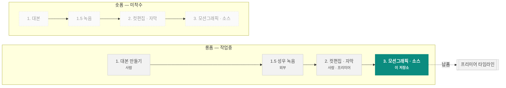

# 차트 컷씬 렌더러

해외선물 유튜브 채널 **차트명가** 영상에 쓸 차트 모션그래픽 소스 영상을 코드로 렌더합니다.

    

📊 **[작업 로그 대시보드](https://claude.ai/code/artifact/cfb762d2-2caf-4a18-8ec2-696b884ac0e1)** · [전체 기록](log/WORKLOG.md) · [새 세션 안내](CLAUDE.md)

---

## 이 저장소가 맡는 곳

영상 한 편은 네 단계를 거칩니다. **이 저장소는 그중 3단계 하나만** 합니다.
나머지는 사람이 프리미어에서 합니다.



| 포맷 | 단계 | 담당 | 상태 | |
|---|---|---|---|---|
| 롱폼 | 1. 대본 만들기 | 사람 | 🔵 자료만 |  |
| 롱폼 | 1.5 성우 녹음 | 외부 | ➖ 해당없음 |  |
| 롱폼 | 2. 컷편집 및 자막 달기 | 사람 | ⚪ 미착수 |  |
| 롱폼 | 3. 모션그래픽 및 소스 넣기 | 이 저장소 | 🟢 진행중 | **← 여기** |
| 숏폼 | 1. 대본 만들기 | 사람 | ⚪ 미착수 |  |
| 숏폼 | 1.5 성우 녹음 | 외부 | ➖ 해당없음 |  |
| 숏폼 | 2. 컷편집 및 자막 달기 | 사람 | ⚪ 미착수 |  |
| 숏폼 | 3. 모션그래픽 및 소스 넣기 | 이 저장소 | ⚪ 미착수 |  |

> 🟢 진행중 · 🔵 결과물만 저장소에 있음 · ⚪ 미착수 · ➖ 저장소가 관여 안 함

**3단계가 받는 것**은 타임코드가 붙은 대본(2단계 산출물), **내놓는 것**은 차트만 있는 영상 클립입니다. 자막·타이틀·로고는 2단계에서 이미 들어가므로 렌더에 넣지 않습니다.

## 롱폼과 숏폼

| | 화면비 | 채널 최종본 | 우리가 납품 | 길이 | 톤앤매너 |
|---|---|---|---|---|---|
| **롱폼** | 16:9 | 1280x720 / 30fps (채널 최종본 실측) | 1920x1080 / 59.94fps (우리가 납품하는 컷씬 소스) | 10~20분 | 차분한 설명조. 기획서+스크립트 6천자 안팎, 섹션 6개(후킹·소개·본론1·문제제시·본론2·아웃트로) |
| **숏폼** | 9:16 | 1080x1920 (채널 최종본 실측) | 미정 | 30~60초 | 미조사. 최종본 60여 편이 드라이브에 있으나 아직 뜯어보지 않았다 |

숏폼은 세로 프레임이라 차트 레이아웃을 다시 잡아야 합니다. 렌더러는 그대로 쓰되 `layout`·`visibleBars` 부터 새로 정해야 하고, 그 전에 최종본 숏츠를 실측해 톤앤매너를 잡는 것이 먼저입니다.

---

## 현황

**롱폼 3단계 내부 절차** `███████████░` 8/9 자동화

| 단계 | 방법 | 담당 |
|---|---|---|
| ✅ 1. 대본 수령 | 타임코드가 붙은 .srt 를 받는다 | 사용자 |
| ✅ 2. 주제·소재·키워드 정리 | 대본에서 검색어가 될 키워드를 뽑는다 | 클로드 |
| ✅ 3. 작업물 폴더 검색 | 이제 드라이브에 붙지 않아도 된다. script_fts 전문 검색과 script_keyword 역인덱스가 저장소 안에 있다 (… | 클로드 |
| ✅ 4. 레퍼런스 확정 | script_keyword 로 키워드 일치율이 가장 높은 회차를 고른다. 그 회차의 최종 .prproj 는 episode_pr… | 클로드 |
| ✅ 5. 레퍼런스 확인 | 그 회차의 .prproj 를 gunzip 해서 XML 을 직접 읽는다. 시퀀스·이펙트·키프레임·애셋 경로가 모두 평문으로 들어… | 클로드 |
| ✅ 6. 컷 설계 + scenes.js 작성 | 타임코드를 프레임으로 환산하고 cmg-20ma-runner.scenes.js 를 본떠 layers 를 채운다 | 클로드 |
| ✅ 7. 구도 확인 | --stills 로 스틸컷을 먼저 본다. 겹침은 여기서 잡는다 | 클로드 |
| ✅ 8. 렌더 | 컷별 프로세스를 코어 수만큼 동시에 띄운다 | 자동 |
| ⬜ 9. 프리미어 반입 | 지금은 사용자가 직접 넣는다. 자동화하려면 사용자 PC 에 프리미어 MCP 설치 필요 | 사용자 |

| 갖춰 놓은 것 | 수 | 쓰임 |
|---|---:|---|
| 대본 인덱스 | 13편 | 새 대본과 겹치는 회차를 전문 검색으로 찾는다 (차명14·15 2편은 아직 빈 템플릿) |
| 회차 프리미어 파일 | 37건 | 레퍼런스 확인 (`.prproj` 를 직접 읽는다) |
| 브랜드 실측값 | 21건 | 색·크기. 레퍼런스 프레임에서 픽셀 단위로 잰 값 |
| 레이어 | 22종 | 컷을 짤 때 쓰는 재료 |
| 회사 모션 문법 | 3종 | 최종본 키프레임에서 뽑은 프레임 수·이징 |

**최근 납품** — 20일선 눌림목 / 조기 익절 4컷, 956프레임 · 1920×1080 · 59.94fps  
**렌더 실측** — 15.95초 클립 기준 순차 93초, 컷별 병렬 45초 (4코어)

---

## 빠른 시작

```bash
npm install
npm run setup:fonts                        # 리눅스만. 폰트 등록
npm run render -- --config scenes/cmg-20ma-runner.scenes.js --all --stills 5
npm run render -- --config scenes/cmg-20ma-runner.scenes.js --all
```

컷별로 쪼개 동시에 돌리면 절반 시간에 끝납니다. 결과물은 순차 렌더와 md5 까지 같습니다.

```bash
for c in cut1-pullback-entry cut2-profit-runs cut3-fear cut4-early-exit; do
  node src/cli.mjs --config scenes/cmg-20ma-runner.scenes.js --scene $c --out out/cmg &
done; wait
```

## 되돌리기

작업 한 덩어리마다 세이브 슬롯을 만듭니다. 슬롯 하나가 그 시점의 저장소 전체입니다.

```bash
python3 log/save.py "어디까지 했는지 한 줄"   # 세이브
python3 log/save.py --list                    # 슬롯 목록
git restore --source=<해시> -- .              # 되돌리기
```

| 시각 (KST) | 슬롯 | 커밋 | 어디까지 |
|---|---|---|---|
| 2026-08-27 10:40 | `save/2026-08-27-1040` | `bdd5a32` | 파이프라인 범위 명시(롱폼 3단계) · README 대시보드 자동 생성 |
| 2026-08-27 10:09 | `save/2026-08-27-1009` | `d5d407a` | 세이브/로드 체계 정리 — 슬롯 목록·되돌리기 안내 |
| 2026-08-27 10:07 | `save/2026-08-27-1007` | `852c061` | 대본 인덱스·prproj 디코드까지 — 세이브/로드 체계 도입 |
| 2026-08-26 19:32 | `save/2026-08-26-1932` | `c6566ed` | 회차별 대본 인덱스 구축, prproj 바이너리 디코드 |
| 2026-08-26 19:14 | `save/2026-08-26-1914` | `dbc37ca` | 작업 방식·렌더 실측·prproj 파싱 결과 기록 |
| 2026-08-26 18:13 | `save/2026-08-26-1813` | `00eaa63` | 복구용 정보 추가 — 환경·명령어·드라이브 ID·레이어 카탈로그 |

---

## 어디에 무엇이 있나

| 경로 | 역할 |
|---|---|
| `README.md` | 렌더러 사용법 · 포맷 선택 기준 · 씬 설정 레퍼런스 |
| `brand/STYLE.md` | 차트명가 브랜드 스펙. 색·레이아웃·폰트·스크립트 6단 구조 |
| `brand/fonts` | Gmarket Sans / S-Core Dream / 나눔고딕 / 경기천년제목 |
| `brand/logo` | 차트명가 로고 7종 |
| `brand/premiere` | 차트명가_메인프리셋(24버전).prproj |
| `brand/reference` | 레퍼런스 영상 캡처 4장. 색을 실측한 원본 |
| `brand/sfx` | 효과음 2종 |
| `brand/texture` | 종이 배경, 모눈종이·땡땡이 패턴, 점선 |
| `brand/ui` | 매수·매도 버튼, 시네마스코프, 댓글 유도 |
| `log/WORKLOG.md` | 이 DB 에서 뽑은 작업 로그 |
| `log/build_worklog_db.py` | 로그 DB 생성. 내용을 고칠 때 여기만 고친다 |
| `log/build_worklog_page.py` | DB → HTML 페이지 |
| `log/worklog.db` | 작업 로그 원본 (SQLite) |
| `log/worklog.html` | 브라우저로 보는 작업 로그 |
| `package.json` | 의존성과 npm 스크립트 |
| `scenes/cmg-20ma-runner.scenes.js` | 차트명가 20일선 4컷. 새 대본은 이 파일을 본떠 만든다 |
| `scenes/nq-basic.scenes.js` | 다크 테마 NQ 6컷 (첫 버전, 브랜드 적용 전) |
| `scenes/nq-overlay.scenes.js` | 투명 배경 오버레이 3컷 |
| `src/cli.mjs` | 렌더 CLI. --all --scene --format --stills --reel |
| `src/market/candles.js` | 시드 고정 캔들 생성기. 추세/박스권/돌파/눌림/급등락 |
| `src/render/anim.js` | 이징·타임라인·cue. in 을 생략하면 처음부터 떠 있는 것으로 본다 |
| `src/render/capture.mjs` | Playwright 프레임 캡처, 크로미움 경로 탐색 |
| `src/render/chart.js` | 캔들·이평선·축·그리드 캔버스 드로잉, 뷰포트 계산 |
| `src/render/encode.mjs` | ffmpeg 인코딩. mp4/mov/alpha/webm/png |
| `src/render/engine.js` | 씬 런타임. 프레임 번호를 받아 그린다 |
| `src/render/layers.js` | 오버레이 레이어 22종. 레이어를 추가하려면 여기 |
| `src/render/scene.html` | 렌더 스테이지. @font-face 선언이 여기 있다 |
| `src/render/server.mjs` | 렌더용 정적 서버 |
| `src/render/theme.js` | 테마 프리셋. dark / chartmyeongga |
| `src/tools/install-fonts.mjs` | 폰트를 시스템에 등록 |

## 컨텍스트가 날아갔을 때

`log/worklog.db` 한 파일에 전부 들어 있습니다. 순서대로 읽으면 됩니다.

```sql
-- 0. 이 저장소가 맡는 범위
-- 1. 무엇을 하는 저장소인가
-- 2. 어디에 무엇이 있나
-- 3. 환경 다시 깔기
-- 4. 렌더 돌리기
-- 5. 새 대본 받으면
-- 6. 원본 자료 위치
-- 7. 대본 받고 납품까지 순서
-- 8. 렌더에 걸리는 시간
-- 9. 지난 회차 대본 찾기
-- 10. 회사 모션 문법
-- 11. 되돌릴 수 있는 시점
SELECT * FROM v_start_here;   -- 이 순서대로
SELECT * FROM v_scope;        -- 파이프라인 어디를 맡는가
SELECT * FROM runbook;        -- 명령어
SELECT * FROM constraint_note;-- 이미 부딪혀 본 벽
```

<sub>이 문서는 `log/worklog.db` 에서 자동 생성됩니다 — `python3 log/build_readme.py`. 직접 고치지 말고 DB 를 고치세요.</sub>
